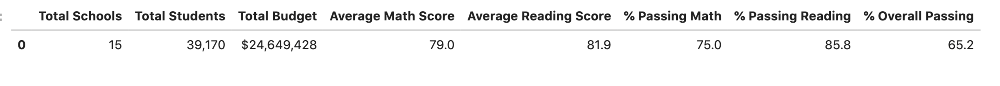

# School_District_Analysis

## Overview
Here we have Maria, the chief data scientist for a city school district. She is responsible for preparing all standardized test data for analysis, reporting, and presentation to provide insights about school's performance trends and patterns. These insights will be used to inform discussions and strategic decisions at the school and district level.

For this project, I helped Maria analyze data on student funding and students' standardized test scores. I was given every access to student's math and reading scores as well as various information on the schools they attend so that I could aggregate the data and showcase trends in school performance. As a result of this analysis, I will be able to assist the school board and superintendent in making decisions regarding the school budgets and priorities.

One particular thing to note for this project is that there has been a report about academic dishonesty. Precisely, reading and math grades for Thomas High School ninth graders appear to have been altered. Although the school board does not know the full extent of the academic dishonesty, they want to uphold state-testing standards and have turned to Maria for help. She has asked me to replace the math and reading scores for Thomas High School with NaNs while keeping the rest of the data intact.  

## Results
- How is the district summary affected?

    - Original District Summary DataFrame
    
    - Updated District Summary DataFrame
    

As shown in the screenshots above, you can see that there isn't that much of a significant change in numbers for each columns in both DataFrames. The updated district summary dataframe seems to have a very small decrease in numbers except for `Average Reading Score`; both dataframes have `81.9`.

- How is the school summary affected?

- How does replacing the ninth graders’ math and reading scores affect Thomas High School’s performance relative to the other schools?

- How does replacing the ninth-grade scores affect the following:
    - Math and reading scores by grade
    - Scores by school spending
    - Scores by school size
    - Scores by school type

## Summary: 

Summarize four changes in the updated school district analysis after reading and math scores for the ninth grade at Thomas High School have been replaced with NaNs.

