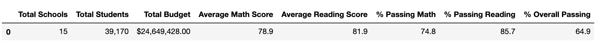

# School_District_Analysis

## Overview
Here we have Maria, the chief data scientist for a city school district. She is responsible for preparing all standardized test data for analysis, reporting, and presentation to provide insights about school's performance trends and patterns. These insights will be used to inform discussions and strategic decisions at the school and district level.

For this project, I helped Maria analyze data on student funding and students' standardized test scores. I was given every access to student's math and reading scores as well as various information on the schools they attend so that I could aggregate the data and showcase trends in school performance. As a result of this analysis, I will be able to assist the school board and superintendent in making decisions regarding the school budgets and priorities.

One particular thing to note for this project is that there has been a report about academic dishonesty. Precisely, reading and math grades for Thomas High School ninth graders appear to have been altered. Although the school board does not know the full extent of the academic dishonesty, they want to uphold state-testing standards and have turned to Maria for help. She has asked me to replace the math and reading scores for Thomas High School with NaNs while keeping the rest of the data intact.  

## Results
- How is the district summary affected?

    - Original District Summary DataFrame
    
    - Updated District Summary DataFrame
    

    As shown in the screenshots above, you can see that there isn't that much of a significant change in numbers for each column in both DataFrames. The updated district summary dataframe seems to have a very small decrease in numbers except for `Average Reading Score`; both dataframes have `81.9`.

- How is the school summary affected? / How does replacing the ninth graders’ math and reading scores affect Thomas High School’s performance relative to the other schools?

    The only variable that contributes to a change to the dataframe is the exclusion of the 9th graders in Thomas High School. When it was created with the 9th graders in Thomas High school being included, the school was ranked at the 8th highest in regards to `% Overall Passing` and you can see its data in the screenshot below:

    

    On the other hand, when the 9th graders were excluded, you can see that the numbers for `% Passing Math`, `% Passing Reading`, and `% Overall Passing` significantly went up and the school is ranked at the 2nd highest in regards to `% Overall Passing`:

    

- How does replacing the ninth-grade scores affect the following:
    - Math and reading scores by grade:
        The math and reading scores for 10th-12th grade remain the same but since we excluded the 9th grade in our analysis, `NaN` is shown for the 9th grade's scores in Thomas High School.
        

    - Scores by school spending:

        There's virtually no changes to the numbers we see between the original and updated DataFrames:
        - Original DataFrame:
        
        - Updated DataFrame:
        

    - Scores by school size:

        Like the DataFrames above, there's also virtually no changes to the numbers we see between the original and updated DataFrames:
        - Original DataFrame:
        
        - Updated DataFrame:
        

    - Scores by school type:

        Like the DataFrames above, there's also virtually no changes to the numbers we see between the original and updated DataFrames:
        - Original DataFrame:
        
        - Updated DataFrame:
        

## Summary: 

After replacing reading and math scores for the ninth grade at Thomas High School with NaNs, we'd suspect there will be changes to the following items in the DataFrame since we are removing data from the dataset: 
    1. Total Student Count
    2. Passing Percentage for Math Scores
    3. Passing Percentage for Reading Scores
    4. Overall Passing Percentage

From the screenshots I've acquired, however, we confirmed that there's virtually no changes to the deduced dataframes. That is, we can go ahead and advise the board that their decisions from the previous dataset shouldn't be too off. 

